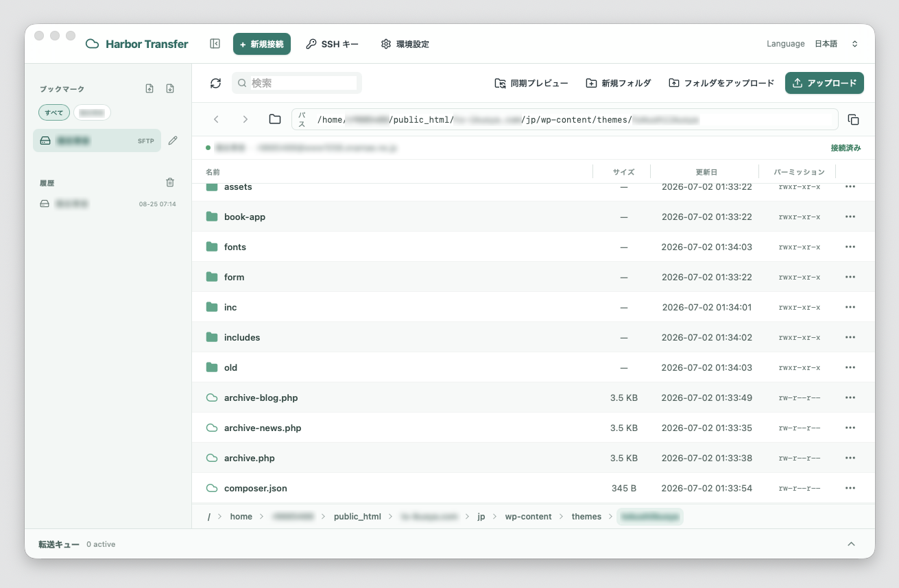

# Harbor Transfer

<p align="center">
  
</p>

Harbor Transfer is a friendly desktop file-transfer client built with **Tauri 2**, **Rust**, and **React**. It provides a Finder-like interface for browsing remote servers, managing saved connections, and tracking transfers without hiding important security details.

> Harbor Transfer is under active development and is not yet a production release.

## Application Preview



## Features

- Connect to remote servers using **SFTP**, **FTP**, **Explicit FTPS**, or **HTTPS WebDAV**.
- Authenticate with a password or an SSH private key.
- Verify SSH host-key fingerprints on first connection and reject unexpected changes.
- Browse remote files in list, icon, or Finder-style column views.
- Navigate with breadcrumbs, direct path entry, parent-folder controls, refresh, and search.
- Display file size, modification date, and permissions when supported by the protocol.
- Upload files, multiple selections, and complete folders, including Finder drag and drop.
- Download, rename, delete, and create remote folders.
- Select a remote file or recursively prepared folder and drag its local copy from list, icon, or column view to Finder or the desktop.
- Open a cached copy of a remote file in a selected macOS editor and automatically overwrite the same remote path after the saved content becomes stable.
- Monitor transfers with progress, speed, remaining time, pause, resume, cancel, and retry controls.
- Resolve duplicate filenames by asking, overwriting, skipping, or choosing another name.
- Save, edit, tag, import, and export bookmarks.
- Associate an optional local directory with each bookmark as the default synchronization source or destination.
- Preview and safely execute one-way synchronization between local and remote directory trees.
- Configure glob-style exclusions, resolve each file conflict, cancel a running synchronization, and review its persistent execution log.
- Review and clear connection and transfer history.
- Manage available SSH keys from the local `~/.ssh` directory.
- Use the interface in English, Japanese, or Simplified Chinese.
- Follow the system appearance or select an explicit light or dark theme, with keyboard-accessible file actions and shortcuts.

## Security and Privacy

- Passwords are stored in the macOS Keychain and are never written to the bookmark database.
- Bookmark exports do not contain passwords, private-key contents, or passphrases.
- SSH private-key contents are not exposed through the user interface.
- FTPS certificate verification remains enabled by default.
- WebDAV always uses HTTPS with certificate verification; its password follows the same macOS Keychain-only storage policy.
- Remote paths are handled as structured application data and are not executed as shell commands.

## Technology

- Tauri 2
- Rust and Tokio
- React and TypeScript
- SQLite for bookmarks and history
- macOS Keychain for passwords
- `russh` / `russh-sftp` for SFTP
- `suppaftp` for FTP and FTPS
- `reqwest`, Rustls, and `quick-xml` for WebDAV

## Development

### Requirements

- macOS
- Rust toolchain
- Node.js
- pnpm
- Tauri 2 system prerequisites

### Install dependencies

```bash
pnpm install
```

### Run the application

```bash
pnpm tauri dev
```

### Run checks

```bash
pnpm test
cargo test --manifest-path src-tauri/Cargo.toml
```

### Build the application

```bash
pnpm tauri build
```

## Project Status

Bookmark management, remote browsing, file operations, transfer controls, SFTP/FTP/FTPS/WebDAV support, safe one-way synchronization, protocol CI, accessibility improvements, and macOS distribution preparation are implemented. S3 is the next planned protocol; automatic updates remain disabled until a signed production feed is available.

See [the roadmap](docs/roadmap.md), [quality checklist](docs/quality-and-release.md), [macOS release guide](docs/macos-release.md), and [functional design](docs/functional-design.md) for more detail.

## Acknowledgments

This software is licensed under the MIT License.
It contains a significant amount of code forked from r-shell.
Thank you, r-shell!
